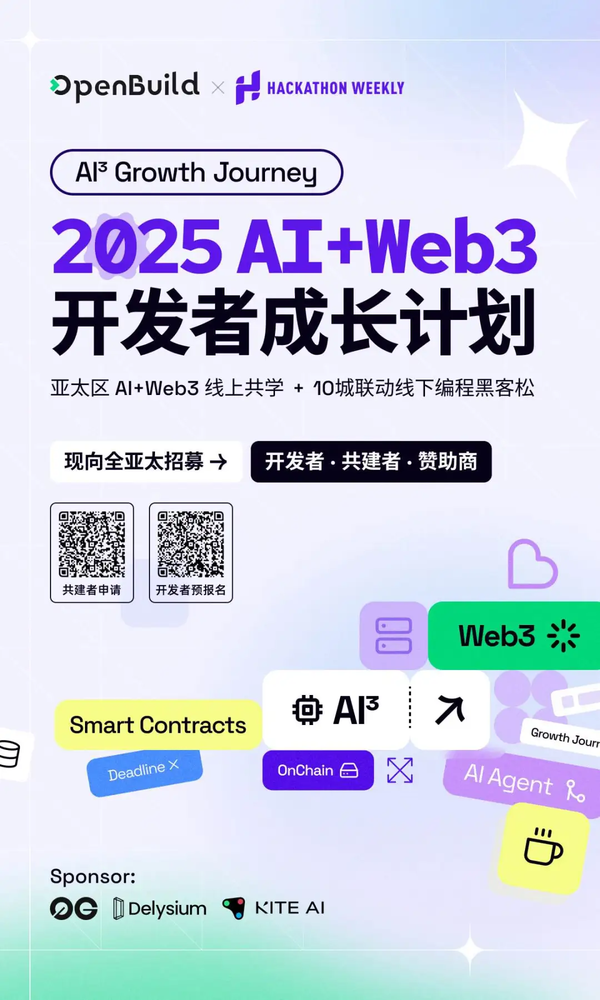

开启你的AI+Web3冒险之旅：开发者、共建者、赞助商招募中！
Image

🌍【AI³ Growth Journey 火热启动】🚀
「AI 正在吞噬软件，Web3 正在重构生产关系」，虽然 Vitalik 与 Sam Altman 还未在达沃斯握手，代码与智能合约却已经在重塑世界的运行规则。此刻，一场横跨亚太的开发者觉醒运动即将启程——　

OpenBuild 与周周黑客松打破次元壁，联合发起亚太区 AI + Web3 开发者成长计划！我们将从 3 月份开始，在未来的 10 个月里，每个月基于 AI + Web3 领域特定主题/生态系统展开线上共学，以及随机选择热点城市举办线下的 Mini-Hackathon，引导开发者产出与特定主题/生态相关的项目应用，你将：　

🔥 每月解锁一个颠覆性命题： 从 AI Agent 到链上智能合约，从 AIGC 游戏到无代码 DApp，每个技术栈都是通往新世界的船票　

🔥 在曼谷的夜市、新加坡的实验室、深圳的海边、上海的弄堂里： 用 12 小时极速开发证明——最锋利的代码，永远诞生于凌晨三点的白板与冰美式之间　

🔥 与 15,000+ 开发者共建： 你的项目将穿越 20 万人的开发者网络，直达顶级孵化器与投资人的雷达　

　

🚩 现向全亚太招募：共建者，开发者，赞助商
👉 立即解锁共建者报名通道！我们寻找这些「带火把的人」：　

技术布道者：用三行代码点燃新手小宇宙的 Web3 / AI 导师，分享 AI / Web3 技术干货，引领开发者成长　

项目炼金师：能把智能合约写成科幻小说的技术文档巫师，解答 AI / Web3 问题、编写技术文档，成为社区技术灯塔　

活动造浪者：策划过让程序员忘记 deadline 的极客狂欢，策划活动、运营社群、现场执行　

　

👉 立即解锁开发者预报名通道：请务必提前报名，火箭满员即将发射🚀　

适用对象：有编程基础/ AIGC 能力/产品设计/运营经验/ Web3 或 AI 爱好者　

奖励：黑客松奖金+孵化器对接+投资机会　

覆盖城市：曼谷/胡志明/吉隆坡/新加坡/北上广深杭等任何你在的地方　

你将获得：　

✅ 赛事最新资讯 & 报名优先权　

✅ 参与黑客松的机会，赢取奖金与资源对接　

　

　

Image
共建者申请　

Image
开发者预报名　

　

👉立即解锁最有远见的赞助商报名通道：致敬改变游戏规则的卓越眼光🤝　

已有3位先知入局，赞助费用：$8,000起　

　

🎁 获取赞助权益：　

全年品牌曝光（20W+开发者触达）　

定制主题黑客松　

提前锁定下一个 V 神级开发者！　

赞助合作：联系人@ian

邮箱 ian@openbuild.xyz / Telegram: callmeianx　

　

🎁 所有参与者即将解锁：　

🎖️ 限量版「赛博功德」NFT勋章（可兑换真实咖啡因补给）　

🛸 宇宙超酷的周周黑客松 X OpenBuild 的独家周边

🍜 与顶级VC共进深夜泡面局的机会　

　

💡 活动亮点　

线上知识库：系统性学习 AI + Web3 技术栈　

线下黑客松：4~24小时极速开发，赢取奖金+神秘机会　

物理外挂：技术大咖指导+资源对接　

主题涵盖：AI Agent/链上数据分析/ AIGC 游戏/AI智能合约/ No-code DApp 开发等　

　

🔥 立即行动　

⌛ 是继续写 CRUD，还是成为定义新大陆的哥伦布？ 键盘上的星辰大海，等你来编译!

对应 Google 文档
背景
AI³ Growth Journey 是由 OpenBuild 与 周周黑客松 联合发起的 AI+Web3 系列活动，我们每月将在亚洲的主要地区（中国、泰国、越南、马来西亚、新加坡、印度等）举办线上 AI+Web3 Wokrshop  和 一次线下 Mini-Hackathon，帮助更多开发者了解和学习 AI+Web3 ，并以构建 AI+Web3 应用为最终目标。
发起团队介绍
OpenBuild
OpenBuild 是亚太最大的 Web3 开源社区之一，致力于将更多开发者带入 Web3 并进行开源贡献。
过去一年 OpenBuild 组织或参与 10+ 场 Web2+Web3 相关的开发者课程/事件，如 Web3 前端训练营、 Web3 开发者转型 Web3 公开课、OpenBuild 高校行、WASM 实战课程、AI+Web3 实战公开课（与零一万物联合发起）、 Rust China Tour（与华为、蚂蚁联合发起）、开源之夏、第九届中国开源年会 等，预计影响了超过 20,000+ Web2 开发者。
我们也获得了 Ethereum, Solana, Monad, Starknet, Fuel, Aptos, Sui, Ton, AO 等众多 Web3 知名项目/基金会的大力支持。
目前 OpenBuild 社区注册开发者超过 15,000 人，渠道可覆盖开发者超过 20W+（不止 Web3， OpenBuild的核心团队来自国内最大的 Python、Rust 及开源社区，可以覆盖主流的 Web2 渠道）
周周黑客松
周周黑客松是目前中国最具活力的 AI 产品创造者社区之一，致力于帮助开发者快速实现最小可行产品 (MVP)。
创建6个月以来，已有超过 4000+ 成员加入。过去的半年里，周周黑客松在六个城市（北京，上海，深圳，广州，杭州，清迈）组织了超过 100 场线下活动，如每周一次的迷你黑客松，开发/创业者交流会，Cursor 开发挑战交流，AI 产品测评会，手搓桌面机器人，3D 打印工作坊，AI共学工作坊，AI 自媒体等，每月还会举办特色的 AI 小酒馆，Demo Day 等活动，累计积累知识库文章近 200 篇。 同时，周周黑客松也和多家主流高校和公司深度合作，共创AI工坊，如深圳科创学院（3D打印），DeepTech,  706媒体社区（12城联动 AI 共学），GSC（AI+艺术），清华（ AI+ 硬件）等。
周周黑客松期待通过定期举办交流会和黑客松，鼓励和支持开发者们的相互链接，帮助每个产品创造者快速实现MVP，我们相信，每一周时间，就可以创造一个最小 MVP，通过AI解决生活中的一个痛点，也许就是下一个改变世界的起点。
形式和产出
我们将从 3 月份开始，每个月基于 AI+Web3 领域特定主题/生态系统展开线上共学，并最终在某一个城市举办线下的 Mini-Hackathon，引导开发者产出与特定主题/生态相关的项目应用（每期 5 + 项目）。
目前暂定的主题/生态：
- Write Smart Contract with AI Code Assistant (Cursor, Copilot)
- How to write a professional AI Prompt
- Build with Web3 AI Agent (ai16z, virtuals)
- OnChain Data Insight with AI
- No code Dapps
- AI Gaming / AIGC in Web3

赞助倡议
欢迎对 AI³ Growth Journey 感兴趣的项目赞助我们的活动，赞助后您将活动以下权益：
- 长达 1 年的系列活动中（每月至少 2 场线上/线下活动）进行品牌曝光和开发者增长，覆盖亚太主要地区
- 基于您的项目进行主题设计和组织 Mini Hackathon 进行项目产出
- 作为长期伙伴，在 OpenBuild 和 周周黑客松 社区中进行宣传
- 挖掘 AI / Web3 领域高质量开发者，提供人才和项目池
赞助费用：$8,000

